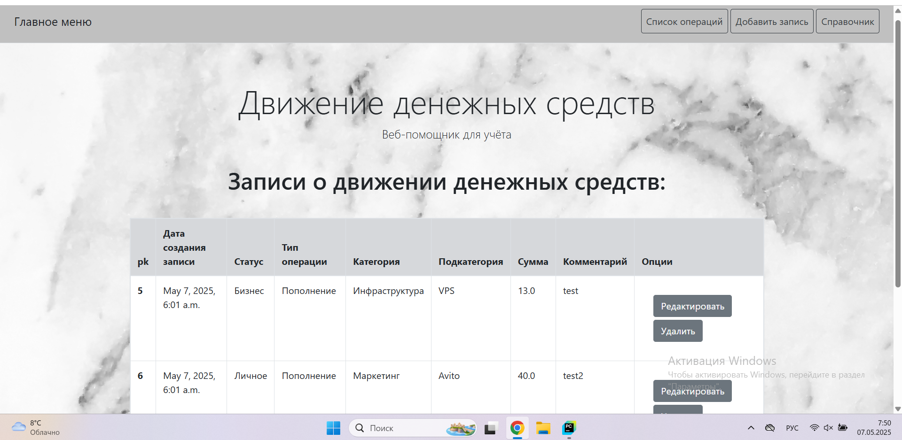

# Веб-сервис для управления движением денежных средств (ДДС)

Описание:
ДДС (движение денежных средств) — это процесс учета, управления и анализа
поступлений и списаний денежных средств компании или частного лица. Пользователь имеет возможность вести учет всех денежных
операций с учетом следующих параметров: создавать, редактировать, удалять и просматривать записи о движении денежных
средств. Веб-приложение удобное, имеет интуитивно понятный
интерфейс и обеспечивает соблюдение логических зависимостей между сущностями.

## Подключение репозитория

Клонируйте репозиторий:

    ```bash
    git clone https://github.com/Alice-K-github/MoneyTracker.git
    cd config
    ```


## Установление зависимостей

Выполните команду в консоли:

    ```bash
    pip install -r requirements.txt
    ```

## Настройка базы данных

База данных уже выбрана по умолчанию в файле `config/settings.py`:

```python
DATABASES = {
    'default': {
        'ENGINE': 'django.db.backends.sqlite3',
        'NAME': BASE_DIR / 'db.sqlite3',
    }
}
```

Чтобы создать базу данных для нашего блога, набери в командной строке следующее: `python manage.py migrate` (мы должны быть в директории `config`, где расположен файл `manage.py`). Если всё прошло успешно, то вы увидите подобный результат:

command-line
```
(myvenv) ~/djangogirls$ python manage.py migrate
Operations to perform:
  Apply all migrations: auth, admin, contenttypes, sessions
Running migrations:
  Rendering model states... DONE
  Applying contenttypes.0001_initial... OK
  Applying auth.0001_initial... OK
  Applying admin.0001_initial... OK
  Applying admin.0002_logentry_remove_auto_add... OK
  Applying contenttypes.0002_remove_content_type_name... OK
  Applying auth.0002_alter_permission_name_max_length... OK
  Applying auth.0003_alter_user_email_max_length... OK
  Applying auth.0004_alter_user_username_opts... OK
  Applying auth.0005_alter_user_last_login_null... OK
  Applying auth.0006_require_contenttypes_0002... OK
  Applying auth.0007_alter_validators_add_error_messages... OK
  Applying sessions.0001_initial... OK
```

Всё готово.

## Запуск веб-сервера

Вы должны быть в директории, где расположен файл `manage.py` (в нашем случае — `config`). Запустим веб-сервер из командной строки: `python manage.py runserver`:

command-line
```
(myvenv) ~/djangogirls$ python manage.py runserver
```

Теперь нужно проверить, работает ли веб-сайт — откройте браузер (Firefox, Chrome, Safari, Internet Explorer или любой другой) и наберите следующий адрес:

browser
```
http://127.0.0.1:8000/
```
Если вы используешь Chromebook или Cloud9, вместо этого нажми на ссылку во всплывающем окне, которая должна появиться в правом верхнем углу командного окна, в котором запущен веб сервер.

